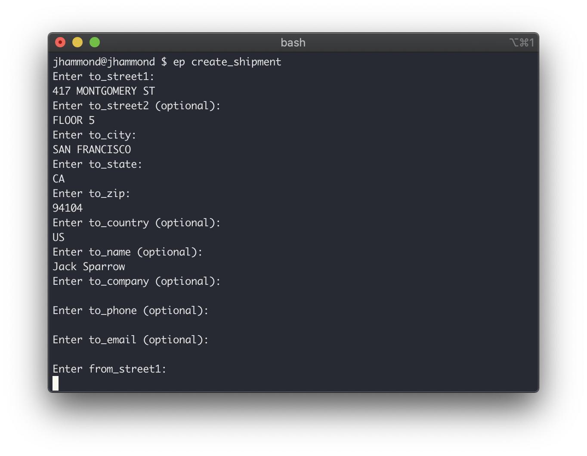

<div align="center">

# EasyPost CLI

The EasyPost API on the CLI.

[](https://github.com/Justintime50/easypost-cli/actions)
[](LICENSE)



</div>

Written in pure `Bash` and only requiring `cURL`, the EasyPost CLI is incredibly portable for both users and developers and simple to use. View the official [EasyPost documentation](https://www.easypost.com/docs/api) for more information about the API or visit the [EasyPost CLI website](https://justintime50.github.io/easypost-cli).

## What Can it Do?

At a high level, the EasyPost CLI can:
- Create and retrieve addresses, parcels, insurance, shipments, pickups, trackers, webhooks, batches, and more
- Buy labels, refund shipments, and rate carriers
- Create and retrieve custom reports
- Lookup EasyPost account details, create child users, and more

## Install on macOS & Linux

```bash
# Setup the tap
brew tap justintime50/formulas

# Install the EasyPost CLI
brew install easypost-cli

# Configure the EasyPost CLI with your API key
echo "EASYPOST_CLI_API_KEY=<your_key_here>" > ~/.easypost-cli-config
```

## Install on Windows

**NOTE:** The EasyPost CLI on Windows is considered "experimental". Please help improve this tool on Windows by submitting issues and pull requests.

The EasyPost CLI on Windows requires that the [Chocolatey package manager](https://chocolatey.org) be installed first which will install `jq` allowing for formatted JSON.

```batch
:: 1) Download and run the install script
curl -LJOs https://raw.githubusercontent.com/justintime50/easypost-cli/main/utils/windows-install.bat && windows-install.bat

:: 2) Setup the config file with your API key
@echo set EASYPOST_CLI_API_KEY=123... > C:/easypost-cli/easypost-cli-config.bat
:: Hide the config file (optional but recommended)
attrib +h C:/easypost-cli/easypost-cli-config.bat

:: 3) Edit your path to allow the EasyPost CLI to be called from anywhere
setx \m PATH %PATH%;C:\easypost-cli
```

## Usage

The EasyPost CLI allows you to run dozens of commands to create or retrieve records from EasyPost. Each command will interactively prompt you for details about that record. View a complete list of commands available in the [EasyPost CLI documentation](https://justintime50.github.io/easypost-cli/man.html)

```bash
# Create a shipment with a single command, you will be prompted for details
ep create_shipment
```

### Documentation

View the full accompanying [EasyPost CLI Docs](/docs/man.md) for a comprehensive list of commands that can be used.

## Development

For a full breakdown of how the EasyPost CLI works under the hood, see the accompanying [EasyPost CLI Developer Docs](/docs/development.md).

### Building the EasyPost CLI

Build the EasyPost CLI, passing in the version number as the first parameter and an optional shell target as the second

```bash
./utils/build.sh 1.1.2 bash
```
